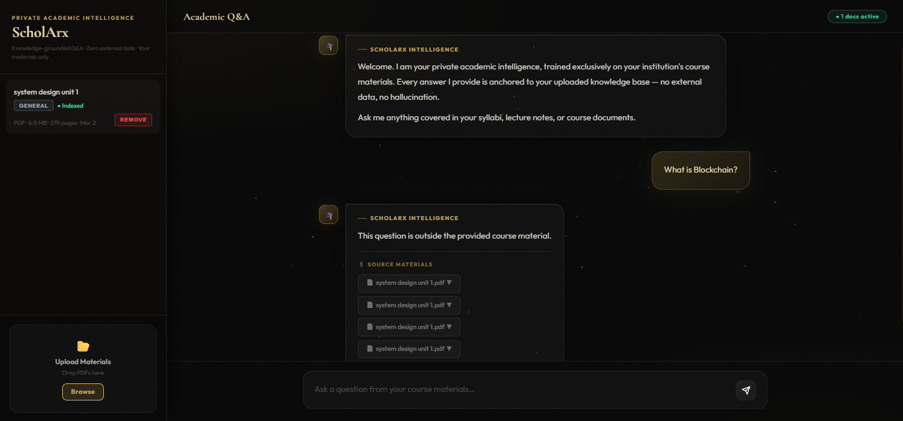
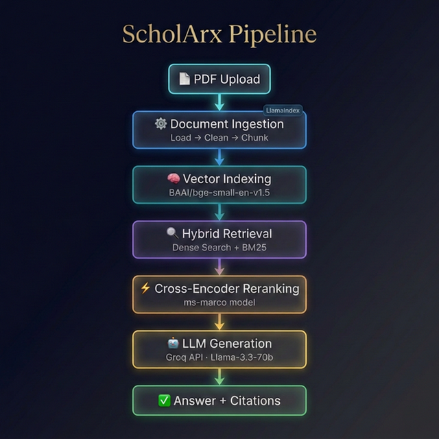

# ScholArx: Academic RAG System 🎓🚀

ScholArx is a **Retrieval-Augmented Generation (RAG)** system created with a purpose of assisting scholarly studies and document analysis. It enables the users to upload PDF papers, textbooks or lecture notes and engage in fluent, evidence-based conversations about their documents. As a guarantee of factual integrity, the system will follow strictly the given content; the model will reject any subject or idea that the system does not know (documents uploaded).




🚀 **[Live Demo](https://rattling-rag-project.hf.space/)**

---

## ✨ Key Features

*   **LlamaIndex RAG Framework**: Powered by **LlamaIndex** for seamless document loading, chunking, and indexing.
*   **Hybrid Retrieval System**: Merges **Dense retrieval** (semantic meaning) using the `BAAI/bge-small-en-v1.5` embedding model with **Sparse retrieval** (BM25 keyword matching) for maximum recall accuracy.
*   **Cross-Encoder Reranking**: Reranks the **top 4 most relevant** candidates using a specialized **ms-marco** model. This prevents overwhelming the system and maintains an optimal context size for the LLM.
*   **Groq API Integration**: Connects to the high-speed **Groq inference engine** using `Llama-3.3-70b-versatile` for near-instant, high-quality answers.
*   **FastAPI Backend**: A high-performance **FastAPI** web server manages all document processing and query handling.
*   **Transparent Citations**: After every answer generation, the system provides clear **source citations**, showing exactly which file the information was extracted from.


---

## 🏗️ Pipeline Overview



---

## 🚀 Getting Started (Local Setup)

### Prerequisites
*   **Python 3.9+**
*   **Node.js & npm**
*   **Groq API Key**: Get one for free at [console.groq.com](https://console.groq.com).

### Quick Installation

1.  **Clone the Repository**:
    ```bash
    git clone https://github.com/RattlingOccupancy/acad-rag.git
    cd scholArx
    ```

2.  **Configure Environment**:
    Create a `.env` file in the root directory and add your Groq API key:
    ```env
    GROQ_API_KEY=gsk_your_key_here
    ```

3.  **Run One-Click Setup**:
    This script automatically creates a Python virtual environment (`.venv`) and installs all dependencies from `requirements.txt`.
    ```powershell
    .\setup.bat
    ```

4.  **Install Frontend Dependencies**:
    ```bash
    cd frontend
    npm install
    cd ..
    ```

### Running the Application

Run the quick-start launcher from the project root:
```powershell
.\start.bat
```
This opens **two terminal windows** simultaneously:
*   **Backend** (FastAPI): `http://localhost:8000`
*   **Frontend** (React/Vite): `http://localhost:5173`
*   **Interactive API Docs**: `http://localhost:8000/docs`

> **Note:** Wait a few seconds for the backend to finish loading the embedding model before uploading files

---

## 📂 Project Structure

```text
Project directory

├── backend/
│   ├── ingestion/
│   │   ├── loaders.py
│   │   ├── cleaner.py
│   │   ├── chunker.py
│   │   └── ingest.py
│   ├── retrieval/
│   │   ├── embed_store.py
│   │   ├── hybrid_search.py
│   │   ├── reranker.py
│   │   ├── build_index.py
│   │   └── search.py
│   ├── api.py
│   ├── config.py
│   └── rag_pipeline.py
│
├── frontend/
│   └── src/
│       ├── Dashboard.jsx
│       ├── App.jsx
│       └── main.jsx
│
├── generation/
│   ├── answer_generator.py
│   └── prompt.py
│
├── evaluation/
│   ├── ragas_eval.py
│   └── ragas_eval_runs.json
│
├── vector_embedding_storage/
├── data/uploads/
├── .env
├── requirements.txt
├── setup.bat
└── start.bat
```

---

## 🛠️ Usage Guide

1.  **Upload PDFs**: In the UI, navigate to the Upload tab and drag-and-drop your academic PDFs. Multiple files are supported.
2.  **Wait for Indexing**: The system will load, clean, chunk your documents and build the vector index automatically.
3.  **Ask Questions**: Type your question in the chat. The system retrieves the best snippets, reranks them, and synthesizes a cited answer.
4.  **View Sources**: Each answer includes the source file name it was extracted from.
5.  **Reset Session**: Use the "Reset" button to clear all uploaded files and indices and start fresh with new documents.


